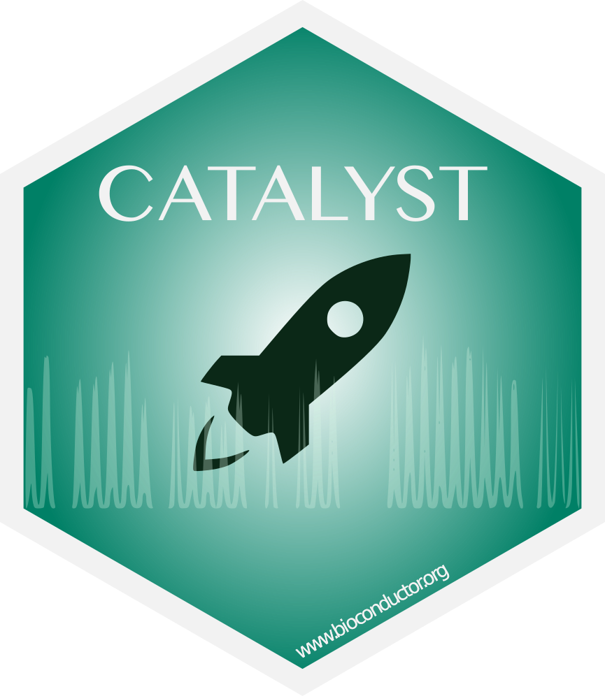

# Welcome to `CATALYST` 

`CATALYST` leverages existing R/Bioconductor infrastructure by building around Biocondcutor's `SingleCellExperiment` class, and by providing an interface for conversion to other data structures established in the cytometry community (e.g., `flowCore`'s `flowFrame/Set` classes), thus facilitating communication with existing tools for visualization (e.g., `ggcyto`) and gating (e.g., `openCyto`).  The package currently provides:

- an extensive suit of visualizations for differential discovery
- a pipeline for preprocessing of cytometry data, including
  - normalization using bead standards
  - single-cell deconvolution
  - bead-based compensation
  
### References

- Chevrier S&#9734;, Crowell HL&#9734;, Zanotelli VRT&#9734;, Engler S, Robinson MD & Bodenmiller B (2018):  
*Compensation of Signal Spillover in Suspension and Imaging Mass Cytometry*. Cell Systems 6(5):612-620.e5. 
- Nowicka M, Krieg C, Crowell HL, Weber LM, Hartmann FJ, Guglietta S, Becher B, Levesque MP & Robinson MD (2017):  
*CyTOF workflow: differential discovery in high-throughput high-dimensional cytometry datasets*. F1000Resaearch 6:748. 

---

### Got a problem (or an idea)?

`CATALYST` is still under active development. We greatly welcome (and highly encourage!) all feedback, bug reports and suggestions for improvement [HERE](https://github.com/HelenaLC/CATALYST/issues). **Please make sure to raise issues with a reproducible example and the output of your `sessionInfo()`.**