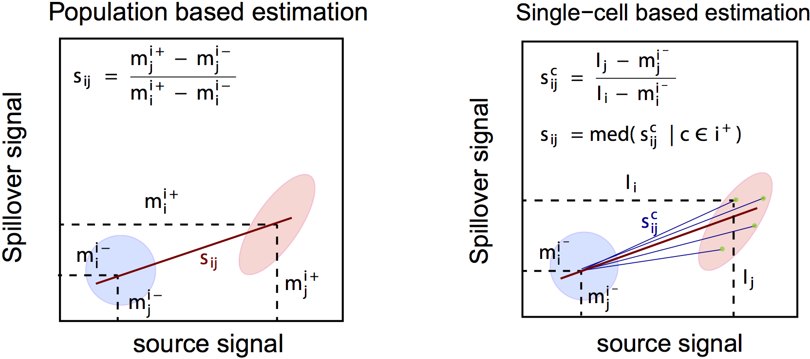
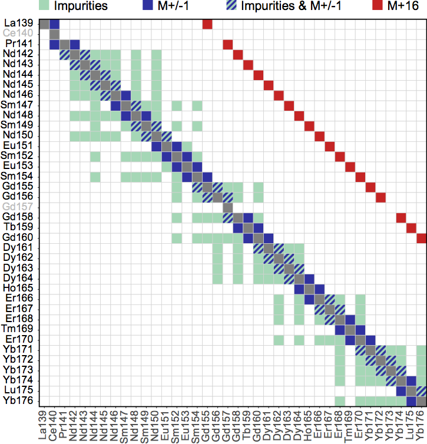

\DeclareMathOperator*{\argmin}{argmin}

```{r setup, include = FALSE}
knitr::opts_chunk$set(cache = TRUE)
```

---

<span style="color:firebrick">**Most of the pipeline and visualizations presented herein have been adapted from @Chevrier2018-CATALYST's *"Compensation of Signal Spillover in Suspension and Imaging Mass Cytometry"* available [here](https://doi.org/10.1016/j.cels.2018.02.010).**</span>

```{r load-libs, warning = FALSE, message = FALSE}
# load required packages
library(CATALYST)
library(cowplot)
library(flowCore)
library(ggplot2)
library(SingleCellExperiment)
```

# Data examples

- **Normalization:**  
`raw_data` is a `flowSet` with 2 experiments, each containing 2'500 raw measurements with a variation of signal over time. Samples were mixed with DVS beads captured by mass channels 140, 151, 153, 165 and 175.
- **Debarocoding:**  
To demonstrate the debarcoding workflow with `r BiocStyle::Biocpkg("CATALYST")`, we provide `sample_ff` which follows a 6-choose-3 barcoding scheme where mass channels 102, 104, 105, 106, 108, and 110 were used for labeling such that each of the 20 individual barcodes are positive for exactly 3 out of the 6 barcode channels. Accompanying this, `sample_key` contains a binary code of length 6 for each sample, e.g. 111000, as its unique identifier.
- **Compensation:**  
Alongside the multiplexed-stained cell sample `mp_cells`, the package contains 36 single-antibody stained controls in `ss_exp` where beads were stained with antibodies captured by mass channels 139, 141 through 156, and 158 through 176, respectively, and pooled together. Note that, to decrease running time, we downsampled to a total of 10'000 events. Lastly, `isotope_list` contains a named list of isotopic compositions for all elements within 75 through 209 u corresponding to the CyTOF mass range at the time of writing [@Coursey2015].

# Data organization

Data used and returned throughout preprocessing are organized into an object of the `r BiocStyle::Biocpkg("SingleCellExperiment")` (SCE) class. A SCE can be constructed from a directory housing a single or set of FCS files, a character vector of the file(s), `flowFrame`(s) or a `flowSet` (from the `r BiocStyle::Biocpkg("flowCore")` package) using `CATALYST`'s `prepData` function. 

`prepData` will automatically identify channels not corresponding to masses (e.g., event times), remove them from the output SCE's assay data, and store them as internal event metadata (`int_colData`).

When multiple files or frames are supplied, `prepData` will concatenate the data into a single object, and argument `by_time` (default `TRUE`) specifies whether runs should be ordered by their acquisition time (`keyword(x, "$BTIM")`, where `x` is a `flowFrame` or `flowSet`). A `"sample_id"` column will be added to the output SCE's `colData` to track which file/frame events originally source from.

Finally, when `transform` (default `TRUE`), an arcsinh-transformation with cofactor `cofactor` (defaults to 5) is applied to the input (count) data, and the resulting expression matrix is stored in the `"exprs"` assay slot of the output SCE.

```{r prepData}
data("raw_data")
(sce <- prepData(raw_data))
# view number of events per sample
table(sce$sample_id)
# view non-mass channels
names(int_colData(sce))
```

# Normalization

`r BiocStyle::Biocpkg("CATALYST")` provides an implementation of bead-based normalization as described by Finck et al. [@Finck2013-normalization]. Here, identification of bead-singlets (used for normalization), as well as of bead-bead and cell-bead doublets (to be removed) is automated as follows: 

1. beads are identified as events with their top signals in the bead channels
1. cell-bead doublets are remove by applying a separation cutoff to the distance between the lowest bead and highest non-bead signal
1. events passing all vertical gates defined by the lower bounds of bead signals are removed (these include bead-bead and bead-cell doublets)
1. bead-bead doublets are removed by applying a default $median\;\pm5\;mad$ rule to events identified in step 2. The remaining bead events are used for normalization.

## Normalization workflow

### `normCytof`: Normalization using bead standards

Since bead gating is automated here, normalization comes down to a single function that takes a `SingleCellExperiment` as input and only requires specification of the `beads` to be used for normalization. Valid options are:

- `"dvs"` for bead masses 140, 151, 153, 165, 175
- `"beta"` for bead masses 139, 141, 159, 169, 175
- or a custom numeric vector of bead masses

By default, we apply a $median\;\pm5\;mad$ rule to remove low- and high-signal events from the bead population used for estimating normalization factors. The extent to which bead populations are trimmed can be adjusted via `trim`. The population will become increasingly narrow and bead-bead doublets will be exluded as the `trim` value decreases. Notably, slight *over-trimming* will **not** affect normalization. It is therefore recommended to choose a `trim` value that is small enough to assure removal of doublets at the cost of a small bead population to normalize to.

`normCytof` will return the following list of SCE(s)...

- `data`: Input dataset including normalized counts (and expressions, if `transform = TRUE`).
    - if `remove_beads = FALSE`, `colData` columns `"is_bead"` and `"remove"` indicate whether an event has been marker as a bead or for removal, respectively.
    - otherwise, bead and doublet events are excluded and the following additional data is returned:
        - `beads`: Subset of identified bead events.
        - `removed`: Subset of all cells that have been from the original dataset,
including bead events as well as bead-bead and bead-cell doublets.

...and `ggplot`-objects:

- `scatter`: Scatter plot of bead vs. DNA intensities with indication of applied gates.
- `lines`: Running-median smoothed bead intensities vs. time before and after normalization.

Besides general normalized parameters (`beads` specifying the normalization beads, and running median windown width `k`), `normCytof` requires as input to `assays` corresponding to count- and expression-like data respectively. Here, correction factors are computed on the linear (count) scale, while automated bead-identification happens on the transformed (expression) scale.

By default, `normCytof` will overwrite the specified `assays` with the normalized data (`overwrite = TRUE`). In order to retain both unnormalized and normalized data, `overwrite` should be set to `FALSE`, in which case normalized counts (and expression, when `transform = TRUE`) will be written to separate assay `normcounts/exprs`, respectively.

```{r normCytof, message = FALSE, fig.width = 8, fig.height = 6}
# construct SCE
sce <- prepData(raw_data)
# apply normalization; keep raw data
res <- normCytof(sce, beads = "dvs", k = 50, 
  assays = c("counts", "exprs"), overwrite = FALSE)
# check number & percentage of bead / removed events
n <- ncol(sce); ns <- c(ncol(res$beads), ncol(res$removed))
data.frame(
    check.names = FALSE, 
    "#" = c(ns[1], ns[2]), 
    "%" = 100*c(ns[1]/n, ns[2]/n),
    row.names = c("beads", "removed"))
# extract data excluding beads & doublets,
# and including normalized intensitied
sce <- res$data
assayNames(sce)
```

```{r normCytof-scatter, fig.wide = TRUE, fig.width = 10, fig.height = 2}
# plot bead vs. dna scatters
res$scatter
```

```{r normCytof-lines, fig.wide = TRUE, fig.width = 8, fig.height = 4}
# plot smoothed bead intensities
res$lines
```

# Debarcoding

`r BiocStyle::Biocpkg("CATALYST")` provides an implementation of the single-cell deconvolution algorithm described by Zunder et al. [@Zunder2015-debarcoding]. The package contains three functions for debarcoding and three visualizations that guide selection of thresholds and give a sense of barcode assignment quality.

In summary, events are assigned to a sample when i) their positive and negative barcode populations are separated by a distance larger than a threshold value and ii) the combination of their positive barcode channels appears in the barcoding scheme. Depending on the supplied scheme, there are two possible ways of arriving at preliminary event assignments:

1. **Doublet-filtering**:  
Given a binary barcoding scheme with a coherent number $k$ of positive channels for all IDs, the $k$ highest channels are considered positive and $n-k$ channels negative. Separation of positive and negative events equates to the difference between the $k$th highest and $(n-k)$th lowest intensity value. If a numeric vector of masses is supplied, the barcoding scheme will be an identity matrix; the most intense channel is considered positive and its respective mass assigned as ID.   
1. **Non-constant number of 1's**:  
Given a non-uniform number of 1's in the binary codes, the highest separation between consecutive barcodes is looked at. In both, the doublet-filtering and the latter case, each event is assigned a binary code that, if matched with a code in the barcoding scheme supplied, dictates which row name will be assigned as ID. Cells whose positive barcodes are still very low or whose binary pattern of positive and negative barcodes doesn't occur in the barcoding scheme will be given ID 0 for *"unassigned"*.

All data required for debarcoding are held in objects of the `r BiocStyle::Biocpkg("SingleCellExperiment")` (SCE) class, allowing for the following easy-to-use workflow:

1. as the initial step of single-cell deconcolution, `assignPrelim` will return a SCE containing the input measurement data, barcoding scheme, and preliminary event assignments.
2. assignments will be made final by `applyCutoffs`. It is recommended to estimate, and possibly adjust, population-specific separation cutoffs by running `estCutoffs` prior to this.
3. `plotYields`, `plotEvents` and `plotMahal` aim to guide selection of devoncolution parameters and to give a sense of the resulting barcode assignment quality.

## Debarcoding workflow

### `assignPrelim`: Assignment of preliminary IDs

The debarcoding process commences by assigning each event a preliminary barcode ID. `assignPrelim` thereby takes either a binary barcoding scheme or a vector of numeric masses as input, and accordingly assigns each event the appropirate row name or mass as ID. FCS files are read into R with `read.FCS` of the `r BiocStyle::Biocpkg("flowCore")` package, and are represented as an object of class `flowFrame`:

```{r}
data(sample_ff)
sample_ff
```

The debarcoding scheme should be a binary table with sample IDs as row and numeric barcode masses as column names:

```{r}
data(sample_key)
head(sample_key)
```

Provided with a `SingleCellExperiment` and a compatible barcoding scheme (barcode masses must occur as parameters in the supplied SCE), `assignPrelim` will add the following data to the input SCE:
- assay slot `"scaled"` containing normalized expression values where each population is scaled to the 95%-quantile of events assigend to the respective population.
- `colData` columns `"bc_id"` and `"delta"` containing barcode IDs and separations between lowest positive and highest negative intensity (on the normalized scale)
- `rowData` column `is_bc` specifying, for each channel, whether it has been specified as a barcode channel

```{r assignPrelim, messages = FALSE} 
sce <- prepData(sample_ff)
(sce <- assignPrelim(sce, sample_key))
# view barcode channels
rownames(sce)[rowData(sce)$is_bc]
# view number of events assigned to each barcode population
table(sce$bc_id)
```

### `estCutoffs`: Estimation of separation cutoffs

As opposed to a single global cutoff, `estCutoffs` will estimate a sample-specific cutoff to deal with barcode population cell yields that decline in an asynchronous fashion. Thus, the choice of thresholds for the distance between negative and positive barcode populations can be *i) automated* and *ii) independent for each barcode*. Nevertheless, reviewing the yield plots (see below), checking and possibly refining separation cutoffs is advisable. 

For the estimation of cutoff parameters we consider yields upon debarcoding as a function of the applied cutoffs. Commonly, this function will be characterized by an initial weak decline, where doublets are excluded, and subsequent rapid decline in yields to zero. Inbetween, low numbers of counts with intermediate barcode separation give rise to a plateau. To facilitate robust estimation, we fit a linear and a three-parameter log-logistic function [@Finney1971] to the yields function with the `LL.3` function of the `r CRANpkg("drc")` R package [@Ritz2015] (Figure \@ref(fig:estCutoffs)). As an adequate cutoff estimate, we target a point that marks the end of the plateau regime and on-set of yield decline to appropriately balance confidence in barcode assignment and cell yield. 

The goodness of the linear fit relative to the log-logistic fit is weighed as follow: 
$$w = \frac{\text{RSS}_{log-logistic}}{\text{RSS}_{log-logistic}+\text{RSS}_{linear}}$$

The cutoffs for both functions are defined as:

$$c_{linear} = -\frac{\beta_0}{2\beta_1}$$
$$c_{log-logistic}=\underset{x}{\arg\min}\:\frac{\vert\:f'(x)\:\vert}{f(x)} > 0.1$$

The final cutoff estimate $c$ is defined as the weighted mean between these estimates:

$$c=(1-w)\cdot c_{log-logistic}+w\cdot c_{linear}$$

![(\#fig:estCutoffs) Description of the automatic cutoff estimation for each individual population. The bar graphs indicate the distribution of cells relative to the barcode distance and the dotted line corresponds to the yield upon debarcoding as a function of the applied separation cutoff. This curve is fitted with a linear regression (blue line) and a three parameter log-logistic function (red line). The cutoff estimate is defined as the mean of estimates derived from both fits, weighted with the goodness of the respective fit.](../inst/extdata/estCutoffs.png)

```{r estCutoffs}
# estimate separation cutoffs
sce <- estCutoffs(sce)
# view separation cutoff estimates
metadata(sce)$sep_cutoffs
```

### `plotYields`: Selecting barcode separation cutoffs

For each barcode, `plotYields` will show the distribution of barcode separations and yields upon debarcoding as a function of separation cutoffs. If available, the currently used separation cutoff as well as its resulting yield within the population is indicated in the plot's main title.

Option `which = 0` will render a summary plot of all barcodes. All yield functions should behave as described above: decline, stagnation, decline. Convergence to 0 yield at low cutoffs is a strong indicator that staining in this channel did not work, and excluding the channel entirely is sensible in this case. It is thus recommended to **always** view the all-barcodes yield plot to eliminate uninformative populations, since small populations may cause difficulties when computing spill estimates.

```{r eval = FALSE}
plotYields(sce, which = c(0, "C1"))
```

```{r plotYields, echo = FALSE, fig.width = 7, fig.height = 3.5}
ps <- plotYields(sce, which = c(0, "C1")); ps[[1]]; ps[[2]]
```

### `applyCutoffs`: Applying deconvolution parameters

Once preliminary assignments have been made, `applyCutoffs` will apply the deconvolution parameters: Outliers are filtered by a Mahalanobis distance threshold, which takes into account each population's covariance, and doublets are removed by excluding events from a population if the separation between their positive and negative signals fall below a separation cutoff. Current thresholds are held in the `sep_cutoffs` and `mhl_cutoff` slots of the SCE's `metadata`. By default, `applyCutoffs` will try to access the `metadata` `"sep_cutoffs"` slopt of the input SCE, requiring having run `estCutoffs` prior to this, or manually specifying a vector or separation cutoffs. Alternatively, a numeric vector of cutoff values or a single, global value may be supplied In either case, it is highly recommended to thoroughly review the yields plot (see above), as the choice of separation cutoffs will determine debarcoding quality and cell yield.

```{r applyCutoffs}
# use global / population-specific separation cutoff(s)
sce2 <- applyCutoffs(sce)
sce3 <- applyCutoffs(sce, sep_cutoffs = 0.35)

# compare yields before and after applying 
# global / population-specific cutoffs
c(specific = mean(sce2$bc_id != 0),
    global = mean(sce3$bc_id != 0))
# proceed with population-specific filtering
sce <- sce2
```

### `plotEvents`: Normalized intensities

Normalized intensities for a barcode can be viewed with `plotEvents`. Here, each event corresponds to the intensities plotted on a vertical line at a given point along the x-axis. Option `which = 0` will display unassigned events, and the number of events shown for a given sample may be varied via argument `n`. If `which = "all"`, the function will render an event plot for all IDs (including 0) with events assigned.

```{r eval = FALSE}
# event plots for unassigned events
# & barcode population D1
plotEvents(sce, which = c(0, "D1"), n = 25)
```

```{r plotEvents, echo = FALSE, fig.width = 6, fig.height = 3}
ps <- plotEvents(sce, which = c(0, "D1"), n = 25); ps[[1]]; ps[[2]]
```

### `plotMahal`: All barcode biaxial plot

Function `plotMahal` will plot all inter-barcode interactions for the population specified with argument `which`. Events are colored by their Mahalanobis distance. <span style="color:firebrick">*NOTE: For more than 7 barcodes (up to 128 samples) the function will render an error, as this visualization is infeasible and hardly informative. Using the default Mahalanobis cutoff value of 30 is recommended in such cases.*</span> 

```{r plotMahal, fig.width = 6, fig.height = 6.5} 
plotMahal(sce, which = "B3")
```

# Compensation

`r BiocStyle::Biocpkg("CATALYST")` performs compensation via a two-step approach comprising: 

i. identification of single positive populations via single-cell debarcoding (SCD) of single-stained beads (or cells)
i. estimation of a spillover matrix (SM) from the populations identified, followed by compensation via multiplication of measurement intensities by its inverse, the compensation matrix (CM).

***Retrieval of real signal.*** As in conventional flow cytometry, we can model spillover linearly, with the channel stained for as predictor, and spill-effected channels as response. Thus, the intensity observed in a given channel $j$ are a linear combination of its real signal and contributions of other channels that spill into it. Let $s_{ij}$ denote the proportion of channel $j$ signal that is due to channel $i$, and $w_j$ the set of channels that spill into channel $j$. Then

$$I_{j, observed}\; = I_{j, real} + \sum_{i\in w_j}{s_{ij}}$$

In matrix notation, measurement intensities may be viewed as the convolution of real intensities and a spillover matrix with dimensions number of events times number of measurement parameters:

$$I_{observed}\; = I_{real} \cdot SM$$

Therefore, we can estimate the real signal, $I_{real}\;$, as:

$$I_{real} = I_{observed}\; \cdot {SM}^{-1} = I_{observed}\; \cdot CM$$ 
where $\text{SM}^{-1}$ is termed compensation matrix ($\text{CM}$). This approach is implemented in `compCytof(..., method = "flow")` and makes use of `r BiocStyle::Biocpkg("flowCore")`'s `compensate` function.

While mathematically exact, the solution to this equation will yield negative values, and does not account for the fact that real signal would be strictly non-negative counts. A computationally efficient way to adress this is the use of non-negative linear least squares (NNLS):

$$\min \: \{ \: ( I_{observed} - SM \cdot I_{real} ) ^ T \cdot ( I_{observed} - SM \cdot I_{real} ) \: \} \quad \text{s.t.} \: I_{real} ≥ 0$$

This approach will solve for $I_{real}$ such that the least squares criterion is optimized under the constraint of non-negativity. To arrive at such a solution we apply the Lawson-Hanson algorithm [@Lawson1974-NNLS1; @Lawson1995-NNLS2] for NNLS implemented in the  `r BiocStyle::Rpackage("nnls")` R package (`method="nnls"`).

***Estimation of SM.*** Because any signal not in a single stain experiment’s primary channel $j$ results from channel crosstalk, each spill entry $s_{ij}$ can be approximated by the slope of a linear regression with channel $j$ signal as the response, and channel $i$ signals as the predictors, where $i\in w_j$. `computeSpillmat()` offers two alternative ways for spillover estimation, summarized in Figure \@ref(fig:methods).

The `default` method approximates this slope with the following single-cell derived estimate: Let $i^+$ denote the set of cells that are possitive in channel $i$, and $s_{ij}^c$ be the channel $i$ to $j$ spill computed for a cell $c$ that has been assigned to this population. We approximate $s_{ij}^c$ as the ratio between the signal in unstained spillover receiving and stained spillover emitting channel, $I_j$ and $I_i$, respectively. The expected background in these channels, $m_j^-$ and $m_i^-$, is computed as the median signal of events that are i) negative in the channels for which spill is estimated ($i$ and $j$); ii) not assigned to potentionally interacting channels; and, iii) not unassigned, and subtracted from all measurements:

$$s_{ij}^c = \frac{I_j - m_j^{i-}}{I_i - m_i^{i-}}$$

Each entry $s_{ij}$ in $\text{SM}$ is then computed as the median spillover across all cells $c\in i^+$:

$$s_{ij} = \text{med}(s_{ij}^c\:|\:c\in i^+)$$

In a population-based fashion, as done in conventional flow cytometry, `method = "classic"` calculates $s_{ij}$ as the slope of a line through the medians (or trimmed means) of stained and unstained populations, $m_j^+$ and $m_i^+$, respectively. Background signal is computed as above and substracted, according to:

$$s_{ij} = \frac{m_j^+-m_j^-}{m_i^+-m_i^-}$$



On the basis of their additive nature, spill values are estimated independently for every pair of interacting channels. `interactions = "default"` thereby exclusively takes into account interactions that are sensible from a chemical and physical point of view:

- $M\pm1$ channels (*abundance sensitivity*)
- the $M+16$ channel (*oxide formation*)
- channels measuring isotopes (*isotopic impurities*) 

See Table \@ref(tab:isotopes) for the list of mass channels considered to potentionally contain isotopic contaminatons, along with a heatmap representation of all interactions considered by the `default` method in Figure \@ref(fig:interactions).

Metal | Isotope masses                    |
----- | --------------------------------- |
La    | 138, 139                          |
Pr    | 141                               |
Nd    | 142, 143, 144, 145, 146, 148, 150 |
Sm    | 144, 147, 148, 149, 150, 152, 154 |
Eu    | 151, 153                          |
Gd    | 152, 154, 155, 156, 157, 158, 160 |
Dy    | 156, 158, 160, 161, 162, 163, 164 |
Er    | 162, 164, 166, 167, 168, 170      |
Tb    | 159                               |
Ho    | 165                               |
Yb    | 168, 170, 171, 172, 173, 174, 176 |
Tm    | 169                               |
Lu    | 175, 176                          |

: (\#tab:isotopes) List of isotopes available for each metal used in CyTOF. In addition to $M\pm1$ and $M+16$ channels, these mass channels are considered during estimation of spill to capture channel crosstalk that is due to isotopic contanimations [@Coursey2015].

{width="80%"}

Alternatively, `interactions = "all"` will compute a spill estimate for all $n\cdot(n-1)$ possible interactions, where $n$ denotes the number of measurement parameters. Estimates falling below the threshold specified by `th` will be set to zero. Lastly, note that diagonal entries $s_{ii} = 1$ for all $i\in 1, ..., n$, so that spill is relative to the total signal measured in a given channel.

## Compensation workflow

### `computeSpillmat`: Estimation of the spillover matrix

Given a SCE of single-stained beads (or cells) and a numeric vector specifying the masses stained for, `computeSpillmat` estimates the spillover matrix (SM) as described above; the estimated SM will be stored in the SCE's `metadata` under `"spillover_matrix"`. 

Spill values are affected my the `method` chosen for their estimation, that is `"median"` or `"mean"`, and, in the latter case, the specified `trim` percentage. The process of adjusting these options and reviewing the compensated data may iterative until compensation is satisfactory.

```{r computeSpillmat} 
# get single-stained control samples
data(ss_exp)

# specify mass channels stained for & debarcode
bc_ms <- c(139, 141:156, 158:176)
sce <- prepData(ss_exp)
sce <- assignPrelim(sce, bc_ms, verbose = FALSE)
sce <- applyCutoffs(estCutoffs(sce))

# compute & extract spillover matrix
sce <- computeSpillmat(sce)
sm <- metadata(sce)$spillover_matrix

# do some sanity checks
chs <- channels(sce)
ss_chs <- chs[rowData(sce)$is_bc]
all(diag(sm[ss_chs, ss_chs]) == 1)
all(sm >= 0 & sm <= 1)
```

### `plotSpillmat`: Spillover matrix heatmap

`plotSpillmat` provides a visualization of estimated spill percentages as a heatmap. Channels without a single-antibody stained control are annotated in grey, and colours are ramped to the highest spillover value present. Option `annotate = TRUE` (the default) will display spill values inside each bin, and the total amount of spill caused and received by each channel on the top and to the right, respectively.

`plotSpillmat` will try and access the SM stored in the input SCE's `"spillover_matrix"` `metadata` slot, requiring having run `computeSpillmat` or manually specifying a matrix of appropriate format.

```{r plotSpillmat, fig.width = 6, fig.height = 6} 
plotSpillmat(sce) 
```

### `compCytof`: Compensation of mass cytometry data

Assuming a linear spillover, `compCytof` compensates mass cytometry based experiments using a provided spillover matrix. If the spillover matrix (SM) does not contain the same set of columns as the input experiment, it will be adapted according to the following rules:

1. columns present in the SM but not in the input data will be removed from it
1. non-metal columns present in the input but not in the SM will be added such that they do neither receive nor cause spill
1. metal columns that have the same mass as a channel present in the SM will receive (but not emit) spillover according to that channel
1. if an added channel could potentially receive spillover (as it has +/-1M or +16M of, or is of the same metal type as another channel measured), a warning will be issued as there could be spillover interactions that have been missed and may lead to faulty compensation

To omit the need to respecify the `cofactor`(s) for transformation, `transform = TRUE` will auto-transform the compensated data. `compCytof` will thereby try to reuse the `cofactor`(s) stored under `int_metadata(sce)$cofactor` from the previously applied transformation; otherwise, the `cofactor` argument should be specified.

If `overwrite = TRUE` (the default), `compCytof` will overwrite the specified counts `assay` (and `exprs`, when `transform = TRUE`) with the compensated data. Otherwise, compensated count (and expression) data will be stored in separate assays `compcounts/exprs`, respectively.

```{r compCytof, message = FALSE, fig.width = 8, fig.height = 3}
# construct SCE of multiplexed cells
data(mp_cells)
sce <- prepData(mp_cells)
# compensate using NNLS-method; keep uncompensated data
sce <- compCytof(sce, sm, method = "nnls", overwrite = FALSE)
# visualize data before & after compensation
chs <- c("Er167Di", "Er168Di")
as <- c("exprs", "compexprs")
ps <- lapply(as, function(a) 
    plotScatter(sce, chs, assay = a))
plot_grid(plotlist = ps, nrow = 1)
```

# Scatter plot visualization

`plotScatter` provides a flexible way of visualizing expression data as biscatters, and supports automated facetting (should more than 2 channels be visualized). Cells may be colored by density (default `color_by = NULL`) or other (non-)continous variables. When coloring by density, `plotScatter` will use `geom_hex` to bin cells into the number of specified `bins`; otherwise cells will be plotted as points. The following code chunks shall illustrate these different functionalities:

## Example 1: Coloring by cell density

```{r plotScatter-1, fig.small = TRUE, fig.height = 2.5}
# biscatter of DNA channels colored by cell density
sce <- prepData(raw_data)
chs <- c("DNA1", "DNA2")
plotScatter(sce, chs)
```

```{r plotScatter-2, fig.width = 6, fig.height = 4}
# biscatters for selected CD-channels
sce <- prepData(mp_cells)
chs <- grep("^CD", rownames(sce), value = TRUE)
chs <- sample(chs, 7)
p <- plotScatter(sce, chs)
p$facet$params$ncol <- 3; p
```

## Example 2: Coloring by variables

```{r plotScatter-3, message = FALSE, fig.width = 6, fig.height = 3}
sce <- prepData(sample_ff)
sce <- assignPrelim(sce, sample_key)
# downsample channels & barcode populations
chs <- sample(rownames(sce), 4)
ids <- sample(rownames(sample_key), 3)
sce <- sce[chs, sce$bc_id %in% ids]

# color by factor variable
plotScatter(sce, chs, color_by = "bc_id")

# color by continuous variable
plotScatter(sce, chs, color_by = "delta")
```

## Example 3: Facetting by variables

```{r plotScatter-4, message = FALSE, fig.width = 6, fig.height = 4}
# sample some random group labels
sce$group_id <- sample(c("groupA", "groupB"), ncol(sce), TRUE)

# selected pair of channels; split by barcode & group ID
plotScatter(sce, sample(chs, 2), 
  color_by = "bc_id",
  facet_by = c("bc_id", "group_id"))
```

```{r plotScatter-5, message = FALSE, fig.width = 6, fig.height = 6}
# selected CD-channels; split by sample
plotScatter(sce, chs, bins = 50, facet_by = "bc_id")
```

# Conversion to other data structures

While the `SingleCellExperiment` class provides many advantages in terms of compactness, interactability and robustness, it can be desirous to write out intermediate files at each preprocessing stage, or to use other packages currently build around `flowCore` infrastructure (`flowFrame` and `flowSet` classes), or classes derived thereof (e.g., `r Biocpkg("flowWorkspace")`'s `GatingSet`). This section demonstrates how to safely convert between these data structures.

## Writing FCS files

Conversion from SCE to `flowFrame`s/`flowSet`, which in turn can be writting to FCS files using `r Biocpkg("flowCore")`'s `write.FCS` function, is not straightforward. It is not recommended to directly write FCS via `write.FCS(flowFrame(t(assay(sce))))`, as this can lead to invalid FCS files or the data being shown on an inappropriate scale in e.g. Cytobank. Instead, `CATALYST` provides the `sce2fcs` function to facilitate correct back-conversion.

`sce2fcs` allows specification of a variable to split the SCE by (argument `split_by`), e.g., to split the data by sample after debarcoding; whether to keep or drop any cell metadata (argument `keep_cd`) and dimension reductions (argument `keep_dr`) available within the object; and which assay data to use (argument `assay`)[^1]: 

[^1]: Only count-like data should be written to FCS files and is guaranteed to show with approporiate scale in Cytobank!

```{r sce2fcs-split, message = FALSE}
# run debarcoding
sce <- prepData(sample_ff)
sce <- assignPrelim(sce, sample_key)
sce <- applyCutoffs(estCutoffs(sce))
# exclude unassigned events
sce <- sce[, sce$bc_id != 0]
# convert to 'flowSet' with one frame per sample
(fs <- sce2fcs(sce, split_by = "bc_id"))
# split check: number of cells per barcode ID
# equals number of cells in each 'flowFrame'
all(c(fsApply(fs, nrow)) == table(sce$bc_id))
```

Having converted out SCE to a `flowSet`, we can write out each of its `flowFrame`s to an FCS file with a meaningful filename that retains the sample of origin:

```{r sce2fcs-write, eval = FALSE}
# get sample identifiers
ids <- fsApply(fs, identifier)
for (id in ids) {
    ff <- fs[[id]]                     # subset 'flowFrame'
    fn <- sprintf("sample_%s.fcs", id) # specify output name that includes ID
    fn <- file.path("...", fn)         # construct output path
    write.FCS(ff, fn)                  # write frame to FCS
}
```

## Gating & visualization

Besides writing out FCS files, conversion to `flowFrame`s/`flowSet` also enables leveraging the existing infrastructure for these classes such as `r Biocpkg("ggcyto")` for visualization and `r Biocpkg("openCyto")` for gating:

```{r sce2fcs-gating, message = FALSE, fig.small = TRUE, fig.height = 2.5}
# load required packages
library(ggcyto)      
library(openCyto)     
library(flowWorkspace) 

# construct 'GatingSet'
sce <- prepData(raw_data) 
ff <- sce2fcs(sce, assay = "exprs")   
gs <- GatingSet(flowSet(ff))

# specify DNA channels
dna_chs <- c("Ir191Di", "Ir193Di")

# apply elliptical gate
gs_add_gating_method(
    gs, alias = "cells", 
    pop = "+", parent = "root",
    dims = paste(dna_chs, collapse = ","),
    gating_method = "flowClust.2d", 
    gating_args = "K=1,q=0.9")

# plot scatter of DNA channels including elliptical gate
ggcyto(gs, 
    aes_string(dna_chs[1], dna_chs[2])) + 
    geom_hex(bins = 128) + 
    geom_gate(data = "cells") +
    facet_null() + ggtitle(NULL) +
    theme(aspect.ratio = 1, 
        panel.grid.minor = element_blank())
```

# Session information

```{r session-info}
sessionInfo()
```

# References